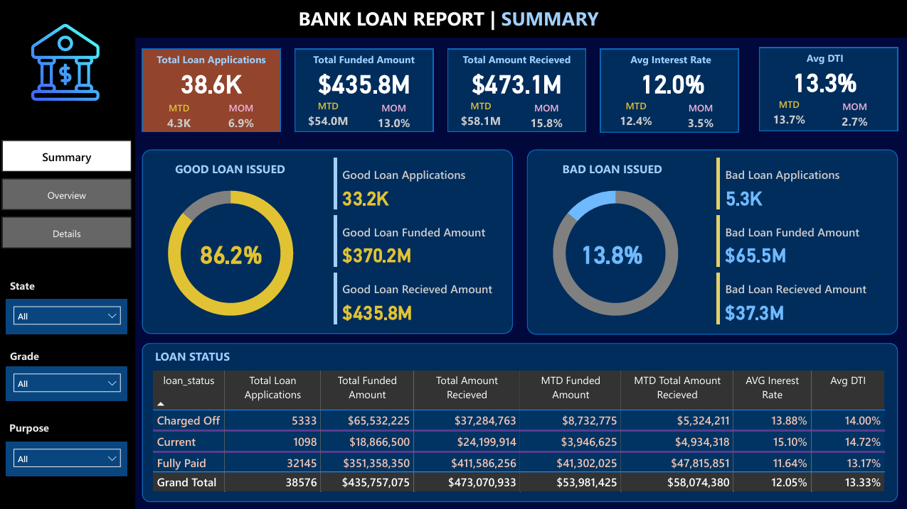
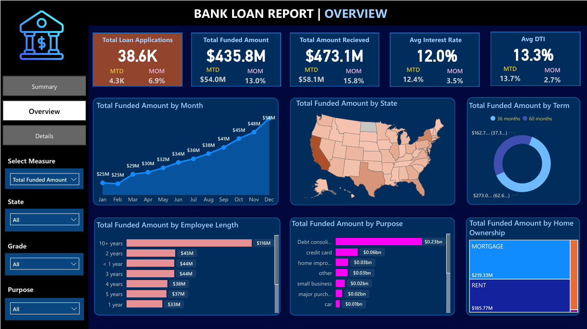
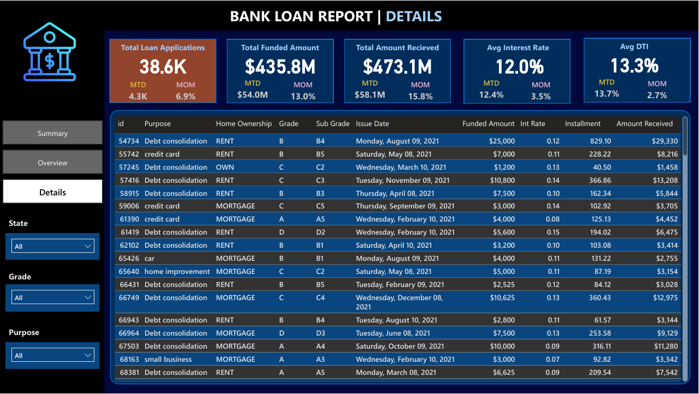

# Financial Loan Analysis and Dashboard

## 📌 Project Overview
This project focuses on analyzing financial loan data using **SQL** and **Power BI** to generate insights and create interactive visualizations. The goal is to extract key metrics and trends related to loan applications, funded amounts, repayment statuses, and borrower details.

## 📊 Power BI Dashboard
Below are the key visualizations from the Power BI dashboard:

### 🔹 Summary View


### 🔹 Overview View


### 🔹 Details View


## 📁 Dataset
The dataset (`financial_loan.csv`) includes financial loan data with attributes such as:
- `id`: Unique identifier for each loan
- `issue_date`: Date the loan was issued
- `loan_amount`: The amount funded
- `total_payment`: Total amount received
- `int_rate`: Interest rate
- `dti`: Debt-to-income ratio
- `loan_status`: Status of the loan (e.g., Fully Paid, Charged Off)
- `address_state`: Borrower's state
- `emp_length`: Length of employment
- `home_ownership`: Type of home ownership
- `purpose`: Purpose of the loan

## 🎯 Objectives
1. **Data Exploration & Cleaning**
   - Understand data structure and key attributes
   - Ensure consistency in date formats and categorical values
2. **SQL Analysis & KPI Extraction**
   - Total loan applications and funded amounts
   - Monthly and previous monthly trends
   - Good vs. bad loan performance
   - Interest rate and debt-to-income (DTI) insights
   - Loan distribution across various dimensions
3. **Power BI Dashboard Development**
   - Visual representation of key metrics
   - Dynamic filters and drill-down analysis
   - Trend analysis over time

## 🗂️ SQL Analysis Queries
The analysis is performed using **SQL queries** to extract the required insights. Key queries include:
- **Loan Applications Overview:** Total number of loans, monthly trends, and funded amounts.
- **Loan Performance Analysis:** Percentage of good vs. bad loans based on payment status.
- **Interest Rate & DTI Analysis:** Average interest rate and debt-to-income ratios.
- **Category-Based Insights:** Loan distribution by state, employment length, home ownership, and purpose.
- **Time-Based Analysis:** Monthly trends of applications, funded amounts, and received payments.

### Sample SQL Queries:
```sql
-- Total loan applications
SELECT COUNT(id) AS total_loan_applications FROM financial_loan;

-- Monthly total applications for December 2021
SELECT COUNT(id) AS MTD_total_applications FROM financial_loan 
WHERE MONTH(issue_date) = 12 AND YEAR(issue_date) = 2021;

-- Good loan percentage
SELECT (COUNT(CASE WHEN loan_status IN ('Fully Paid', 'Current') THEN id END) * 100.0) / COUNT(id) AS good_loan_perc FROM financial_loan;
```

### 📂 `doc` Folder
The `doc` folder contains:
- Screenshots of SQL query outputs
- Query results for validation against the Power BI dashboard


## 📈 Power BI Dashboard
The **Power BI dashboard** visualizes the SQL analysis results, providing insights into:
- Total loan applications and trends
- Monthly comparison of loan funding and repayments
- Good vs. bad loan distribution
- Borrower demographics and risk analysis

### 🔍 Dashboard Screenshots:
- `Summary.PNG` - Key insights and KPIs
- `Overview.PNG` - Loan distribution and repayment trends
- `Details.PNG` - Deep dive into borrower characteristics

## 🚀 Tools & Technologies
- **SQL**: Data extraction and KPI computation
- **Power BI**: Interactive dashboard creation
- **Excel/Pandas**: Data preprocessing and analysis (if needed)

## 📢 Conclusion
This project provides a comprehensive analysis of financial loans using SQL and Power BI. By leveraging structured queries and visualization tools, we can extract meaningful insights to support better decision-making in loan approvals and risk assessment.

---

### 💡 Future Enhancements
- Incorporate **machine learning** models for loan default prediction
- Automate data pipeline integration for real-time insights
- Enhance dashboard interactivity with additional filters

## 🔗 Repository Structure
```
📂 Financial_Loan_Analysis
 ├── 📄 financial_loan.csv  # Dataset
 ├── 📄 SQL_Analysis.sql     # SQL queries
 ├── 📄 Summary.PNG         # Dashboard screenshot
 ├── 📄 Overview.PNG        # Dashboard screenshot
 ├── 📄 Details.PNG         # Dashboard screenshot
 ├── 📄 README.md           # Project documentation
 ├── 📄 doc                 # Snippest of each query and output

```

## 🏆 Author
**[Gamal Osama]**  
_Data Scientist | Business Intelligence Analyst_


🔗 : [LinkedIn](www.linkedin.com/in/gamal-osama)
